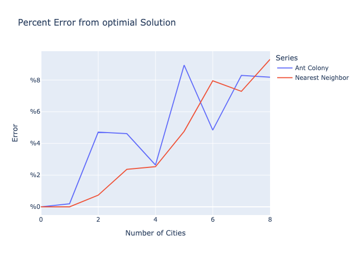
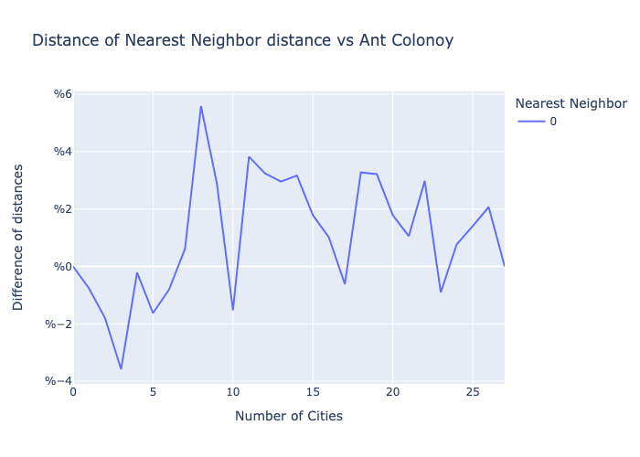
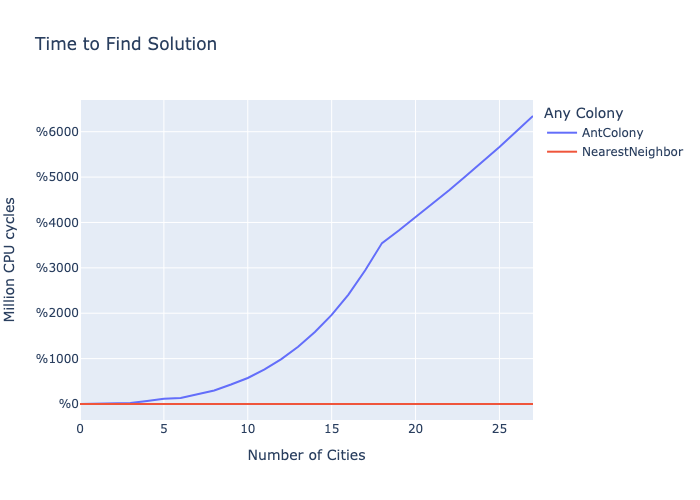

# sic-optimization

For exploring various optimization heuristics.

## Ant Colony Optimization and the Traveling Salesman Problem

Currently the files explore the viability of Ant Colony Optimization (ACO) to solve a Traveling Salesman Problem. Wherin we must
find the shortest route to visit a set of N cities. An example of a usecase is for a delivery company to find the shortest route
to complete its daily log. in root/data the .csv files show that ACO is able to solve problems even up to 50 cities while having
a predictable increase of computation time. Meanwhile Brute Force becomes untenable at 11 cities and even using Branch and Bound
with a close upper bound is too unpredictable on its computation time as you never know when devolve into an exhaustive search,
hence in the general case Branch and Bound also becomes untenable around 11 cities.

Above gives a baseline how close both methods are to the optimal solution for 10 cities max.

### Testing

In this test we iterate from 2 to 30 cities and randomly generate that number of cities taking a sample of 30 for each given city.
Both the Ant Colony and Nearest Neighbor are used to find the shortest tour and we take the average of the result for the number
of cities. Note that the parameters the Ant Colony we purposefully not optimized to cap computation costs.

We can see that Nearest Neighbor on average gives a longer path for the trade off of taking a much shorter time to compute. Note
that Nearest Neighbor on average doesn't go more than 10% higher than the Ant Colony Result. We Can conclude that Ant Colony
optimization may be a viable alternative to Nearest Neighbor if you need to optimize distance but care must be taken to tune and
optimze the hyperparameters.
