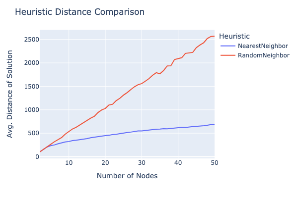

## Various optimization algorithms

## Source Code

Source code can be found <a href
=https://github.com/ShameekConyers/sic-optimization> here </a>

## Preliminaries

- All tests are preformed with a sample size of 30
- Implementation of algorithms follows the canonical one found on Wikipedia
  , unless stated otherwise.
- Source Code has assertions that make sure every solution is valid

---

## Traveling Salesman Problem

### Problem Description and Motivation

Given a collection of nodes $X = \{x_1, \ldots,  x_n\}$ with an associated
set of weighted edges $E = \{ (x_i, x_j, d_{i,j})| \space x_i, x_j \in X\}$
, where the weight $d_{i, j}$ is the distance between $x_i$ and $x_j$. Find the
shortest path to visit each $x_i$ in $X$ and return to $x_1$ after. For our
implementation we will also add the restriction that as $max(d_{i, j}) =
\alpha$, this makes density increase as we add more nodes instead of
adding spacing.

An example of a real world scenario is suppose you run a logistics company wherein
you have to ship  morning packages to $n$ number of customers every morning. Of
course, as a profit maximizing firm it is imperative for you to find the shortest
distance to cut down on gas expenditure, billed driver hours, and to increase
client satisfaction. One could modify the distance function to account for speed
limits, traffic, etc easily allowing extensibility.

The first thought would be to just take $X$ and try every permutation of
elements until you find the shortest path. However, this would
result in having to check

$$n! = n \cdot(n - 1) \ldots 1$$

number of solutions, while this may seem innocent $11!$ is approximately 4
billion, and hence unfeasible to calculate in this manner. Given the TSP problem
can be classified as NP-Hard there is no deterministic algorithm that solves
it in polynomial time - hence we typically rely on non-deterministic heuristics
to find solutions after 10 nodes.

### Why use a heuristic?

Suppose you see the problem starts to become intractable after you reach only 10
nodes and you decide to just randomly pick nodes to travel to instead.
Below is a comparison between random picking vs the simplest heuristic out
there: simply picking the closest node to travel to.

Above we see as the number of nodes increases randomly picking your next choice
will lead to a highly unoptimal solution even compared to the simplest way of
informed selection.

### Possible Heuristics

#### Branch and Bound

This is an exact algorithm that prunes path's if they go above the best distance
found already. The problem is if many of the distances are close enough you will
devolve into a brute force search, given you cannot know the chances of pruning
upfront this makes this method unreliable as a standard heuristic - but it is
strictly superior alternative to calculating the exact distance. One could
improve the average running time by improving the pruning of the possible paths.

#### Nearest Neighbor
The simplest possible (good) heuristic is continually picking the closest
neighbor of our given node until we run out of options and then returning to our
start node. This is a fast implementation that on average finds a solution only
25% worse than the optimal solution. Given how fast this algorithm is it is
phenomenal at using as an initial guess for other heuristics. One could also
try to optimize this algorithm by looking ahead and having some discount future
function.

#### Ant System
An interesting alternative is called the
Ant System algorithm and it's derivative implementations. The Ant System is
a learning algorithm that tries to mimic biological optimization used by ants.
Given a collection of nodes $X$ the corresponding weighted edges also have
a value which represents the amount "pheromones" present i.e.
$E = \{ (x_i, x_j, (d_{i,j}, p_{i, j})| \space x_i, x_j \in X\}$. Each Ant
deposits pheromones for each edge from the graph it selects wherein the better
solutions deposit more pheromones on each edge. Each ants selects a node based
on a fuction that takes into account both pheromone deposited and the distance
of that given edge. $H(p, d)$. In effect this means after a given number of
iterations better solutions will be selected for and bad solutions will be
pruned.

#### Simulated Annealing

Simulated Annealing works by traversing state space to try and
find the global minimum of some goal function, In our case we are looking to
minimize the distance a tour will take. To traverse the state space one finds
some sort of state transition for our current state and given an acceptance
function we decide to accept this transition or not. This acceptance function
is informed by a parameter called "temperature" which decays, such that we
accept worse solutions less as time goes on. We always accept a better solution
than our current one. For our implementation our state transition function is
defined by selecting a random segment of our tour and then allowing two
operations: reverse and splice. reverse simply reverses the segment in place
while splice takes the segment and puts it into another portion of our path.

#### Comparison vs Exact

  

  

Above we see that Brute Force and it's improvement Branch and Bound, , start becoming intractable at 12 nodes compared to our heuristics, hence solving
this problem exactly is not feasible. Also note that Simulated Annealing was
able to find the exact solutions on each test.

### Heuristic Comparison at Scale.

  

  

Above we see that while the Ant System always performs better than the Neighbor
in finding an optimal solution as density increases the time to compute
the solution doubles roughly every 10 additional nodes. This implies the
time complexity $O'(n) = cn$ and hence $O(n) = cn^2$ where $c$ is an arbitrary
constant such that $c \in R^+$. While this is substantially better than $O(n) =
cn!$ for the exact algorithm it starts to become unfeasible as $n \rarr \infty$.
While we can suppose that a learning heuristic such as the Ant System could be
useful as an alternative in an optimization problem, our implementation
of Simulated Annealing seems to only increase linearly in time giving us $O(n)=cn$
which is much better especially as time goes on. Furthermore, we can also see
Simulated Annealing performs much better than the other two heuristics and hence
we can see the this would be the preferred heuristic to use, especially since
it can be generalized to any optimization problem which you can boil down to
traversing a state space where you can be informed by a loss function.
