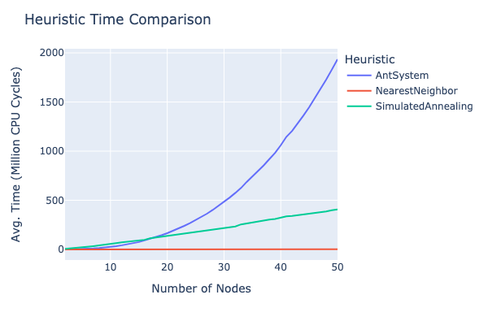

## Various optimization algorithms

## Source Code

Source code can be found <a href
=https://github.com/ShameekConyers/sic-optimization> here </a>

## Preliminaries

- All tests are preformed with a sample size of 30,

---

## Traveling Salesman Problem

### Problem Description and Motivation

Given a collection of nodes $X = \{x_1, \ldots,  x_n\}$ with an associated
set of weighted edges $E = \{ (x_i, x_j, d_{i,j})| \space x_i, x_j \in X\}$
, where the weight $d_{i, j}$ is the distance between $x_i$ and $x_j$. Find the
shortest path to visit each $x_i$ in $X$ and return to $x_1$ after. For our
implementation we will also add the restriction that as $max(d_{i, j}) =
\alpha$, this makes density increase as we add more nodes instead of
adding spacing.

An example of a real world scenario is suppose you run a logistics company wherein
you have to ship  morning packages to $n$ number of customers every morning. Of
course, as a profit maximizing firm it is imperative for you to find the shortest
distance to cut down on gas expenditure, billed driver hours, and to increase
client satisfaction. One could adjust modify the distance to account for speed
limits, traffic, etc easily allowing extensibility.

The first thought would be to just take $X$ and try every permutation of
elements until you find the shortest path. However, this would
result in having to check

$$n! = n \cdot(n - 1) \ldots 1$$

number of solutions, while this may seem innocent $11!$ is approximately 4
billion, and hence unfeasible to calculate in this manner. Given the TSP problem
can be classified as NP-Hard there is no deterministic algorithm that solves
it in polynomial time - hence we typically rely on non-deterministic heuristics
to find solutions after 10 nodes.

### Why use a heuristic?

Suppose you see the problem starts to become intractable after you reach only 10
nodes and you decide to just randomly pick nodes to travel to instead.
Below is a comparison between random picking vs the simplest heuristic out
there: simply picking the closest node to travel to.

Above we see as the number of nodes increases randomly picking your next choice
will lead to a highly unoptimal solution even compared to the simplest way of
informed selection.

### Possible Heuristics

The simplest possible (good) heuristic is continually picking the closest
neighbor of our given node until we run out of options and then returning to our
start node. This is a fast implementation that on average finds a solution only
25% worse than the optimal solution. An interesting alternative is called the
Ant System algorithm and it's derivative implementations. The Ant System is
a learning algorithm that tries to mimic biological optimization used by ants.
Given a collection of nodes $X$ the corresponding weighted edges also have
a value which represents the amount "pheromones" present i.e.
$E = \{ (x_i, x_j, (d_{i,j}, p_{i, j})| \space x_i, x_j \in X\}$. Each Ant
deposits pheromones for each edge from the graph it selects wherein the better
solutions deposit more pheromones on each edge. Each ants selects a node based
on a fuction that takes into account both pheromone deposited and the distance
of that given edge. $H(p, d)$. In effect this means after a given number of
iterations better solutions will be selected for and bad solutions will be
pruned.

#### Comparison vs Exact

Above we see that Brute Force and it's improvement Branch and Bound
start becoming intractable at 10 nodes compared to our heuristics, hence solving
this problem exactly is not feasible.

#### Nearest Neighbor vs Ant System

Above we see that while the Ant System always performs better than the Neighbor
in finding an optimal solution as density increases the time to compute
the solution doubles roughly every 10 additional nodes. This implies the
time complexity $O'(n) = cn$ and hence $O(n) = cn^2$ where $c$ is an arbitrary
constant such that $c \in R^+$. While this is substantially better than $O(n) =
cn!$ for the exact algorithm it starts to become unfeasible as $n \rarr \infty$.
Hence we can suppose that a learning heuristic such as the Ant System could be
useful as an alternative in an optimization problem.
